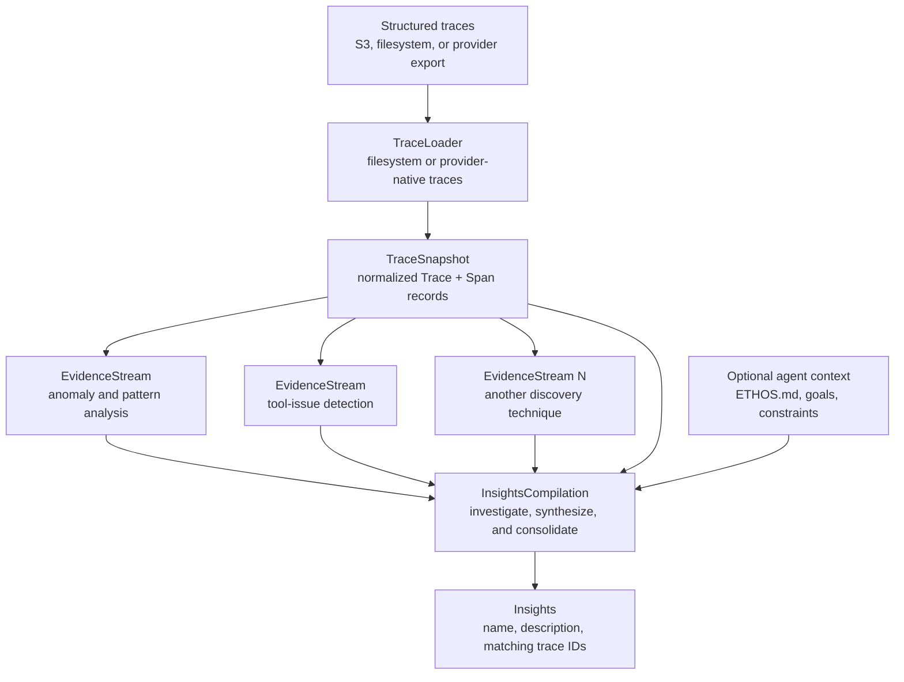

<!-- SPDX-FileCopyrightText: Copyright (c) 2025-2026 NVIDIA CORPORATION & AFFILIATES. All rights reserved. -->
<!-- SPDX-License-Identifier: Apache-2.0 -->

# Trace Analyst architecture

Trace Analyst takes in agent runtime execution traces and identifies
different problems (known as Insights) identified in the agent.

The trace loader ingests traces from different formats and agent observability
providers and converts them into a canonical `TraceSnapshot` shared by the rest
of the pipeline. `FSDataLoader` reads canonical JSONL directly. The MLflow
loaders, LangSmith Trace Loader, and LangSmith Trace Export File Loader map
provider records into the same local models without exposing provider SDK
classes downstream.

Evidence streams are different issue detectors that run on top of the
TraceSnapshot and detect different kinds of problems with the agent.

Finally, the insight compilation step verifies and combines insights from all of
the different evidence streams and combines it with existing insights.

```text
TraceLoader -> EvidenceStream(s) -> Insight compilation
```


