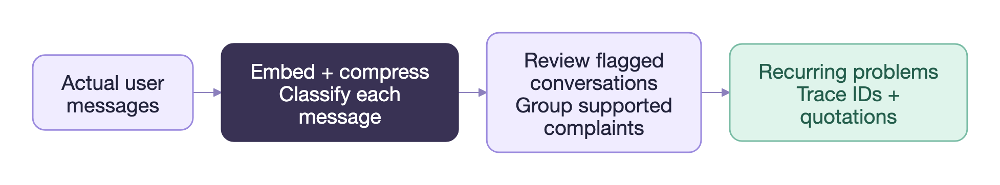

<!-- SPDX-FileCopyrightText: Copyright (c) 2025-2026 NVIDIA CORPORATION & AFFILIATES. All rights reserved. -->
<!-- SPDX-License-Identifier: Apache-2.0 -->

# Trace Analyst architecture

Trace Analyst analyzes recorded agent executions from production and evaluation runs to identify
recurring problems. It has three stages: ingestion, evidence discovery, and insight compilation.

Five evidence streams analyze business requirements, user complaints, evaluation results, tool
behavior, and statistical patterns. They use deterministic checks, learned classifiers, and LLM
investigation, with each stream implementing the same
[interface](../src/insight_agent/evidence_streams/evidence_streams.py): check prerequisites, analyze
the snapshot, and return candidate `Problem` objects containing a description and supporting trace
IDs. Results can also include analysis artifacts, coverage limitations, and reasons for skipping
analysis. Partners can run the complete analyst, reuse individual evidence streams or trace loaders.

[Insight compilation](../src/insight_agent/insights_generation/insight_compilation.py) investigates
candidates in their original traces, assesses their impact and whether a developer can fix them,
merges duplicates across streams and existing insights, and ranks the results. Its instructions
require each new insight to have support from more than one trace and to merge symptoms only when
they establish the same problem. These decisions rely on model judgment. Before compilation, an
optional [code-aware validator](../src/insight_agent/insights_generation/validation.py) checks
candidates against the agent’s source using read-only search and file access. It removes claims
contradicted by the code and retains unresolved ones. Each resulting insight includes supporting
trace references for developer review.

## Ethos divergence

The ethos-divergence stream compares observed behavior with a document describing the agent’s
business purpose, requirements, and limits. This document, called `ETHOS.md`, defines expected
behavior independently of the implementation. For example, a support agent might be allowed to
explain refund policy but forbidden to issue refunds. The stream would investigate a recorded refund
action as a possible violation, even if the tool call succeeded.

The stream supplies the document and trace snapshot to an LLM issue detector. Its instructions
require reviewing the visible conversation and identifying which requirement was violated and how.
Requirements apply within their stated scope, and the business contract takes precedence when the
agent’s system prompt permits conflicting behavior. The review considers the agent’s response to an
out-of-scope request when determining whether a violation occurred.

Approval requirements, supported workflows, customer commitments, and limits on delegated authority
often need domain-specific evaluation. This stream lets teams assess those requirements directly
from a written specification, including requirements they have yet to cover with formal tests. Clear
requirements and complete conversational evidence reduce ambiguity in the review.

Business requirements also help interpret findings from other streams. A correct refusal may explain
a user’s complaint, while a successful tool call may violate an approval requirement. Comparing
these observations with the documented requirements helps compilation determine whether the behavior
needs to change.

The stream requires a non-empty requirements document and skips analysis when none is configured. An
observability platform could store this document at the project level and display findings against
the relevant requirements. The [ethos-divergence
implementation](../src/insight_agent/evidence_streams/ethos_divergence/ethos_divergence_detector.py)
defines configuration and evaluation instructions; the shared [issue
detector](../src/insight_agent/evidence_streams/issue_detector.py) defines the output descriptions
and supporting trace references.

## User sentiment

The user-sentiment stream finds recurring complaints in recorded human messages, including
corrections made later in a conversation. It captures reports of ignored instructions, repeated
misunderstandings, and dissatisfaction with the agent’s work. Production conversations can provide
this feedback even when evaluation labels are sparse. The stream screens messages for anger or
criticism, then investigates recurring complaint themes.

An LLM inspects the recorded message formats and constructs an extraction function, which processes
the snapshot in the caller’s process. The extraction instructions identify actual human turns,
preserve later messages, and account for accumulated conversation history. Generated documents and
evaluator inputs can also appear under a `user` role, so extraction must establish authorship from
the source structure. Runtime checks require the result to cover exactly the supplied trace IDs.

Each message is screened independently using Qwen3-Embedding-8B, PCA256, four-bit MSE TurboQuant
compression, and logistic regression. The pipeline projects normalized 4,096-dimensional embeddings
into 256 dimensions and stores each compressed vector in 132 bytes. The classifier reconstructs
those features before scoring them. Any flagged message routes its trace to contextual review,
including when later messages are neutral. Embeddings can run locally or through a remote endpoint;
projection and classification run locally. The model, input convention, projection, and classifier
must remain compatible, so a replacement embedding model requires an appropriately trained head and
validation.

An LLM then inspects the flagged conversations and groups complaints by their supported reasons.
Review instructions require separate occurrences in at least two distinct traces and representative
verbatim quotations. They also require identifying whether criticism concerns the agent or an
external subject and distinguishing the user’s stated reason from an inferred cause. Classifier
scores are uncalibrated and used to select conversations for this review.

Screening reduces the set of conversations sent for detailed review. The separate representation and
classification components also allow partners to train and evaluate additional heads for other
tasks. Running the current stream requires preserved human messages and a compatible embedding
backend; its results report coverage for traces lacking user text. The [stream
implementation](../src/insight_agent/evidence_streams/user_sentiment/stream.py) handles extraction
and review, with the [embedding
pipeline](../src/insight_agent/evidence_streams/user_embedding/embedding.py) and
[classifier](../src/insight_agent/evidence_streams/user_sentiment/classifier.py) implemented
separately.

## Evaluation failures

The evaluation-failure stream investigates recurring behavior associated with recorded scores and
feedback. It reads `evaluator_results` attached to normalized traces and uses them to select
executions for investigation. Repeated low correctness scores, for example, may lead it to inspect
whether several executions failed at the same step. Evaluation results must already be present in
the input traces.

The stream builds a compact index containing trace IDs, logical case IDs, evaluator results, tool
names, and recorded errors. An LLM investigator uses the index to select and retrieve complete
traces. This allows it to inspect summary information before fetching the detailed executions needed
for an explanation. Configuration limits the number of fetch rounds.

A runtime postcondition requires the investigator to fetch every trace it cites. Investigation
instructions require grouping traces by the observed failure and including the relevant evaluator
names and values in each problem description. Since the same score can result from different
failures, the investigator must examine execution evidence before grouping cases. It must also
distinguish associations in the data from established causes.

Teams with evaluation datasets, human feedback, or model-based graders can use this stream to
investigate score changes and identify repeated failures for developers to address. The analysis can
help explain which behaviors contribute to an aggregate result. Its conclusions depend on evaluator
quality and coverage, and the result reports how many traces lack evaluation signals.

Integration requires preserving evaluator names and values during normalization, along with
execution details that can explain the results. The compact index and trace-retrieval pattern can
also support other investigations over large traces. The [evaluation-failure
implementation](../src/insight_agent/evidence_streams/eval_failure_patterns.py) contains the index,
bounded retrieval tool, citation postcondition, and investigation instructions. The stream skips
when no non-null evaluator results are available.

## Tool issues

The tool-issue stream applies deterministic rules to recorded tool calls and results. It detects
unknown tools, malformed or invalid arguments, missing or mismatched results, explicit failures, and
unsuccessful retry patterns. These checks help diagnose failures caused by API contracts, missing
prerequisites, or orchestration code.

The implementation defines nineteen finding types covering tool contracts, call/result integrity,
explicit outcomes, retries, instrumentation, argument provenance, and prerequisite or state
failures. Each check requires specific recorded evidence. Argument-schema checks need schemas, for
example, while some outcome checks need only calls and results. Rules abstain when required evidence
is unavailable, so diagnostic coverage depends on what the trace records preserve.

Findings retain trace IDs, call identifiers, and source pointers. The stream groups them into
evidence cards by issue type and mechanism, with representative examples and counts of independent
logical cases. By default, a card becomes eligible for insight generation after appearing in three
independent cases. Findings below that threshold remain in the audit artifacts. Counting cases
separately from individual failures limits the effect of repeated errors within one execution.

The rules produce reproducible findings that developers can inspect at the call level. Repeated
omission of a required argument, for example, identifies a specific contract violation to
investigate in the agent’s prompt, tool schema, or calling code. Compilation examines the
surrounding execution to assess impact and recovery before promoting the finding to an insight.
Instrumentation findings can also identify incomplete or inconsistent trace records.

Partners can run the audit independently of LLM analysis, display evidence cards beside tool spans,
or pass eligible problems to the analyst. Integration should preserve tool names, arguments,
results, identifiers, schemas when available, and logical case identity. The [tool-issue
implementation](../src/insight_agent/evidence_streams/tool_issues/stream.py) contains normalization,
detection rules, card construction, and problem promotion. Its artifacts retain both individual
findings and the recurring groups used for insight generation.

## Anomalies and patterns

The anomaly-and-pattern stream identifies unusual execution patterns and recurring failures across a
corpus. It can help developers select traces to investigate when evaluation labels and user feedback
are unavailable or when existing checks have left a failure unexplained. An outlier may reflect
either a defect or legitimate variation in the tasks being performed; interpreting it requires
reviewing the execution.

The stream extracts numeric features including tool-call count, trajectory length, tool diversity,
repeated-call rate, explicit-failure rate, output size, and recorded tool duration. It scores
outliers with an Isolation Forest and reports feature-level deviations to help interpret them.
Configuration controls the expected outlier fraction, optional robust scaling, and feature
selection, including supplied numeric metrics. Corpus composition affects the comparison: complex
research tasks may be legitimate outliers in a dataset dominated by simple requests.

The stream also groups execution trajectories using TF-IDF representations of ordered event unigrams
and bigrams, followed by K-means clustering. It compares candidate cluster counts using silhouette
scores. These features capture similarities in local execution sequences that aggregate call counts
can miss. Clustering requires at least three traces and two distinct feature vectors; the other
analyses can complete when clustering is unavailable. Trajectory clusters and observed verdict
groups are retained as descriptive artifacts.

Explicit failures are grouped by normalized signatures within and across tools, with a default
recurrence threshold of three distinct traces. Similar errors can help locate repeated integration
failures or a common upstream dependency, though their causes still require investigation.
Statistical outliers and recurring same-tool or cross-tool failure groups become candidate problems.
Features, clusters, verdict groups, and an evidence digest remain available for inspection.

Partners can reuse feature extraction, trajectory grouping, and failure-signature analysis
separately and configure them for their own trace populations. These methods can surface behavior
that existing rubrics and complaint classifiers do not cover. The [anomaly-and-pattern
implementation](../src/insight_agent/evidence_streams/anomaly_and_patterns/stream.py) contains the
analysis methods and shared-stream adapter. In the full analyst, compilation reviews these
candidates alongside findings from the other streams to determine which problems have sufficient
support and a practical remedy.

---

For configuration and prerequisites, see [Evidence streams](evidence-streams.md).
