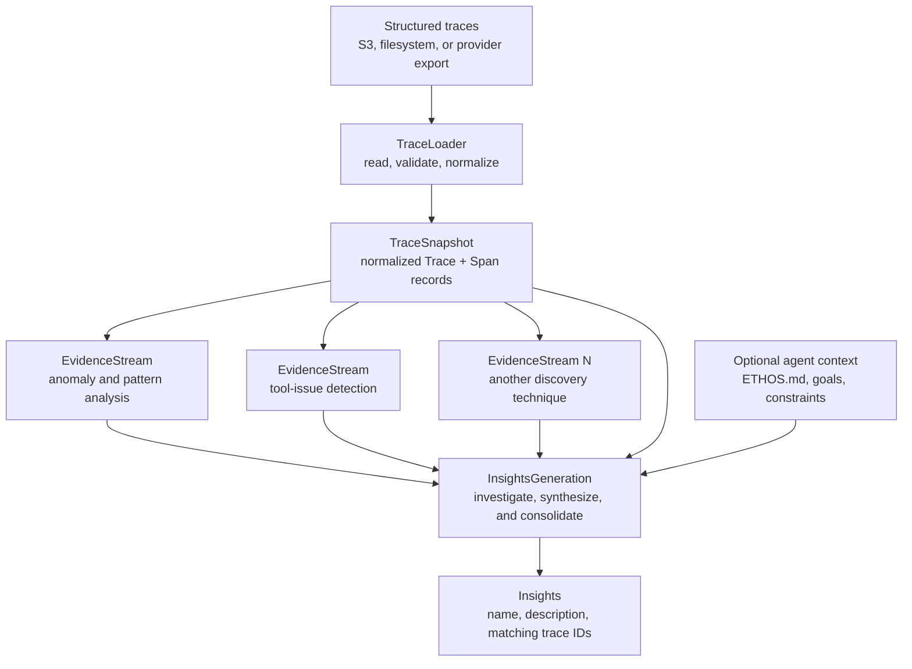
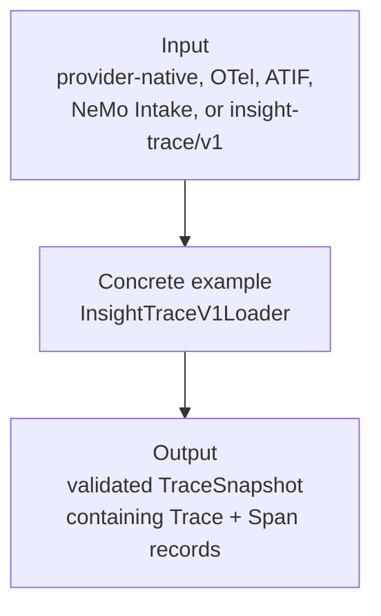
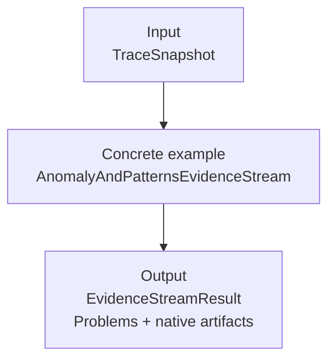
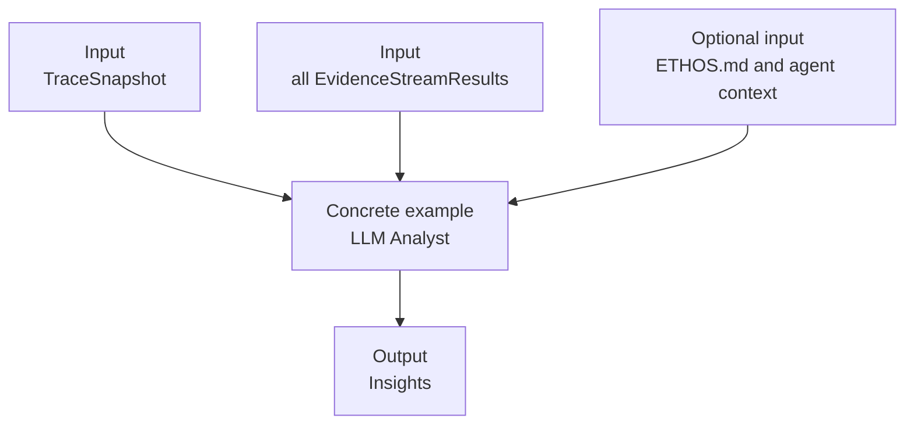

# Analyst architecture

The Analyst has one required product: **Insights**. Its top-level architecture is deliberately
small:

```text
TraceLoader -> TraceSnapshot -> EvidenceStream(s) -> InsightsGeneration -> Insights
```



`TraceLoader` is the input boundary, not a generic pipeline phase. Each loader owns the I/O,
validation, and normalization for one source and returns the local normalized contract. The
current `InsightTraceV1Loader` reads the repository's `insight-trace/v1` JSONL format. A future
LangSmith, OpenTelemetry, ATIF, or NeMo Platform loader would emit the same `Trace` values
directly; it would not translate through `insight-trace/v1` first.

## 1. TraceLoader and TraceSnapshot



The loader contract is intentionally one method:

```python
class TraceLoader(Protocol):
    def load(self) -> TraceSnapshot: ...
```

Source-specific configuration and diagnostics stay on the concrete loader. Evidence streams
never receive provider records or loader objects.

A `TraceSnapshot` is the frozen, run-scoped view of the normalized corpus. It gives every
evidence stream and `InsightsGeneration` the same traces, span trees, source pointers, tool
definitions, and corpus identity.

### Normalized Trace

The normalized model follows the useful shape of NeMo Platform Intake without importing its
models or depending on its service. A trace provides an end-to-end summary and contains one
canonically ordered, parent-linked array of spans. Each span records one unit of agent work,
such as an LLM call, tool call, agent turn, chain, retriever, or evaluator.

Unlike NeMo Platform's storage/API models, this contract keeps `input` and `output` as JSON
values. An LLM span can therefore preserve complete input and output messages instead of
flattening them into text.

The contract is implemented as frozen Pydantic v2 models. Its essential shape is:

```python
class SpanKind(StrEnum):
    LLM = "LLM"
    TOOL = "TOOL"
    AGENT = "AGENT"
    CHAIN = "CHAIN"
    RETRIEVER = "RETRIEVER"
    EMBEDDING = "EMBEDDING"
    RERANKER = "RERANKER"
    EVALUATOR = "EVALUATOR"
    GUARDRAIL = "GUARDRAIL"
    UNKNOWN = "UNKNOWN"


class SpanStatus(StrEnum):
    SUCCESS = "success"
    ERROR = "error"
    CANCELLED = "cancelled"
    UNKNOWN = "unknown"


class ToolCall(ContractModel):
    call_id: str | None = None
    index: int | None = None
    result_id: str | None = None
    result_count: int = 1
    instrumentation_alias_of: str | None = None
    prior_user_text: str | None = None
    returned_data: bool | UNSET = UNSET


class Span(ContractModel):
    span_id: str
    kind: SpanKind
    status: SpanStatus
    started_at: datetime | None = None
    parent_span_id: str | None = None
    name: str | None = None
    subtype: str | None = None
    summary: str | None = None
    ended_at: datetime | None = None
    duration_ms: float | None = None
    input: JsonValue | UNSET = UNSET
    output: JsonValue | UNSET = UNSET
    provider: str | None = None
    model: str | None = None
    tool_name: str | None = None
    input_tokens: int | None = None
    output_tokens: int | None = None
    cached_tokens: int | None = None
    total_tokens: int | None = None
    cost_usd: float | None = None
    error_type: str | None = None
    error_message: str | None = None
    tool_call: ToolCall | None = None
    source_pointer: dict[str, JsonValue] = Field(default_factory=dict)
    attributes: dict[str, JsonValue] = Field(default_factory=dict)


class Trace(ContractModel):
    id: str
    spans: tuple[Span, ...]  # canonical topological-temporal order
    schema_version: Literal["trace/v1"] = "trace/v1"
    root_span_id: str | None = None
    session_id: str | None = None
    name: str | None = None
    input: JsonValue | UNSET = UNSET
    output: JsonValue | UNSET = UNSET
    started_at: datetime | None = None
    ended_at: datetime | None = None
    status: SpanStatus = SpanStatus.UNKNOWN
    agent_name: str | None = None
    agent_version: str | None = None
    input_tokens: int | None = None
    output_tokens: int | None = None
    cached_tokens: int | None = None
    total_tokens: int | None = None
    cost_usd: float | None = None
    models: tuple[str, ...] = ()
    providers: tuple[str, ...] = ()
    tool_catalog: dict[str, JsonValue | None] | None = None
    logical_case_id: str | None = None
    observed_verdict: str | None = None
    metrics: dict[str, float] = Field(default_factory=dict)
    complete_provenance_context: bool = False
    orphan_results: tuple[dict[str, JsonValue], ...] = ()
    evaluation_context: dict[str, JsonValue] = Field(default_factory=dict)
    source_pointer: dict[str, JsonValue] = Field(default_factory=dict)
    attributes: dict[str, JsonValue] = Field(default_factory=dict)
```

`UNSET` is Pydantic's missing sentinel and is distinct from JSON `null`. For example, an absent tool-span `output` means no result
was observed, while `"output": null` means the tool returned `null`. IA3 depends on that
distinction.

Normalizers should populate span timestamps when the source records them. They are nullable
because a source may preserve authoritative order without wall-clock time; normalization does
not fabricate timestamps merely to satisfy the model.

`Trace.spans` represents both sequence and nesting:

- Array order is authoritative for evidence streams. Normalization produces one stable
  topological-temporal order: a parent always precedes its descendants; otherwise spans are
  ordered by `started_at`, with stable source order and then `span_id` breaking ties. Evidence
  streams do not independently re-sort spans.
- `parent_span_id` represents topology. A flat array can describe arbitrarily deep nesting,
  such as `AGENT -> CHAIN -> AGENT -> LLM`, without recursively embedding spans. Parent and
  child spans need not be adjacent in the array.
- `root_span_id` identifies the root when one is known. Within a complete trace, span IDs must
  be unique, every non-root parent must resolve inside the same trace, and parent links must be
  acyclic. A partial export must say that it is partial rather than silently inventing parents.

Consumers that need a recursive view can derive `children(span_id)` or `span_tree()` from the
same array. That view is a convenience and is not a second serialized representation.

A normalized record can preserve LLM messages and tool activity in one span tree:

```json
{
  "schema_version": "trace/v1",
  "id": "trace-123",
  "root_span_id": "agent-1",
  "session_id": "session-42",
  "name": "research-agent",
  "input": [{"role": "user", "content": "Find the latest report"}],
  "output": [{"role": "assistant", "content": "I found the report."}],
  "started_at": "2026-08-26T18:00:00Z",
  "ended_at": "2026-08-26T18:00:02Z",
  "status": "success",
  "spans": [
    {
      "span_id": "agent-1",
      "parent_span_id": null,
      "kind": "AGENT",
      "status": "success",
      "name": "research-agent",
      "started_at": "2026-08-26T18:00:00Z",
      "ended_at": "2026-08-26T18:00:02Z"
    },
    {
      "span_id": "llm-1",
      "parent_span_id": "agent-1",
      "kind": "LLM",
      "status": "success",
      "name": "reason-and-select-tool",
      "started_at": "2026-08-26T18:00:00Z",
      "ended_at": "2026-08-26T18:00:01Z",
      "provider": "openai",
      "model": "example-model",
      "input": {
        "messages": [
          {"role": "system", "content": "Use tools when needed."},
          {"role": "user", "content": "Find the latest report"}
        ]
      },
      "output": {
        "messages": [
          {
            "role": "assistant",
            "content": "",
            "tool_calls": [
              {"id": "call-1", "name": "search", "arguments": {"query": "latest report"}}
            ]
          }
        ]
      },
      "input_tokens": 120,
      "output_tokens": 24,
      "total_tokens": 144
    },
    {
      "span_id": "call-1",
      "parent_span_id": "agent-1",
      "kind": "TOOL",
      "status": "success",
      "name": "search",
      "tool_name": "search",
      "started_at": "2026-08-26T18:00:01Z",
      "ended_at": "2026-08-26T18:00:02Z",
      "input": {"query": "latest report"},
      "output": {"documents": ["report-2026-08"]}
    }
  ]
}
```

The trace-level input, output, token, cost, model, provider, status, and timing fields summarize
the span tree. They can be supplied by the source or computed during normalization, but their
provenance must be recorded so captured values are distinguishable from derived values.

The existing engines consume projections of this richer model:

- IA2 derives its ordered steps, tool calls, cost, verdicts, and numeric features from spans
  and trace-level fields.
- IA3 derives `CallRecord` values from `TOOL` spans and uses the trace's tool catalog and
  provenance attributes.
- New evidence streams can inspect LLM messages, model calls, token usage, latency, retrieval,
  guardrail, evaluator, and user-interaction spans without another schema redesign.

Concrete example: `InsightTraceV1Loader` validates `insight-trace/v1` records, maps their
steps and calls into normalized spans, and returns a snapshot. A future loader for NeMo
Platform would map its API objects into these local models; it would not return or import
NeMo Platform classes.

### Snapshot handoff

`TraceSnapshot` is a logical handle to one stable corpus, not a requirement to hold every
trace in memory. The first implementation exposes one access pattern: a re-iterable scan.

Conceptually:

```python
class TraceSnapshot(Protocol):
    source: str
    trace_count: int

    def scan(self) -> Iterator[Trace]:
        """Return a new iterator over the same canonical traces each time."""
```

Each call to `scan()` must start from the beginning and yield the same normalized traces in the
same order. It must not return a shared one-shot generator: multiple evidence streams need to
scan the same snapshot independently, and may eventually do so concurrently.

The first backing implementation is in memory. A JSONL or S3-backed implementation can be
added later if measurements show it is needed, without changing the evidence-stream interface.

Batch iteration and indexed `get_many(trace_ids)` lookup are deliberately deferred. They can be
added when scale measurements or Insights generation require them without changing the meaning
of `TraceSnapshot` or `scan()`.

## 2. EvidenceStream(s)



Evidence streams independently surface evidence that may support an Insight. Every stream:

- reads the same `TraceSnapshot`;
- can be enabled, disabled, and evaluated independently;
- does not read prior Insights or another stream's result;
- returns candidate `Problem` values with supporting trace IDs;
- may retain native artifacts for focused inspection and evaluation.

A stream may contain complex internal steps. IA2, for example, performs feature extraction,
anomaly detection, clustering, and recurring-pattern analysis. Those actions belong to IA2;
they do not become top-level Analyst stages.

```python
class EvidenceStream(Protocol):
    name: str

    def analyze(
        self,
        snapshot: TraceSnapshot,
    ) -> EvidenceStreamResult: ...


class Problem(ContractModel):
    description: str
    supporting_trace_ids: tuple[str, ...]


class EvidenceStreamResult(ContractModel):
    stream_name: str
    problems: tuple[Problem, ...]
    artifacts: Any = None
```

`Problem` is the common handoff to Insights generation. It says what may be wrong and which
normalized traces support investigating it. It does not claim root cause, impact, prevalence,
or that every matching trace has been found.

Native stream outputs remain available in `artifacts`, such as IA2's feature and clustering
results or IA3's findings and cards. They support diagnostics and evaluation but are not part
of the synthesis interface. Each stream owns the projection from its native analysis into
Problems, including its own evidence threshold.

The result does not carry generic coverage, status, version, or metrics fields. A stream that
cannot run raises an error; an empty `problems` tuple means it found nothing worth surfacing.
Stream-specific diagnostics remain in its typed artifacts. Input capability diagnostics, such
as IA3's per-rule coverage report, remain separate because they do not share a useful generic
shape across evidence streams.

Stable algorithm outputs are typed at the stream boundary as well. IA2 returns an
`AnomalyAndPatternsAnalysis` with typed anomalies and recurring-failure groups; IA3 returns
typed `ToolIssueCard` values with typed representative evidence. Temporary detector structures
can remain local dictionaries, but code outside the algorithm uses validated model attributes.

The Analyst collects the results and passes them directly to `InsightsGeneration`. Collection
is ordinary orchestration, not a separate merge or composition phase.

## 3. InsightsGeneration



`InsightsGeneration` is a required, concrete Analyst capability—not a generic postprocessor.
It uses the evidence streams as a map, inspects supporting normalized traces from the snapshot, and
authors customer-readable Insights. It may consolidate overlapping evidence from multiple
streams, but evidence streams themselves remain independent.

The implementation is an explicit stage object:

```python
generation = InsightsGeneration(
    snapshot=snapshot,
    evidence=stream_results,
    agent=agent_name,
    corpus=corpus_description,
)
result = generation.generate()
insights = result.insights
```

Concrete example: the existing Analyst receives Problems from IA2 and IA3, fetches their
supporting canonical traces, and produces Insights through a versioned LLM prompt. It has no
dependency on either stream's native artifact type. The implementation and its prompt live
together under `insights_generation/`.

Historical reconciliation, lifecycle management, and comprehensive trace categorization can
be implemented inside this concrete capability as they are added. They do not require generic
postprocessor abstractions or additional top-level boxes.

## 4. Insights

Insights are the product contract, not an optional artifact. A successful run always emits an
Insights collection; an empty collection means the Analyst found nothing worth surfacing.

The current repository emits JSON objects with this shape:

```python
class Insight(TypedDict):
    name: str
    description: str
    trace_ids: list[str]
```

Stable identity, status, prevalence, and user decisions can extend this contract when insight
lifecycle management is implemented. The core requirement remains that every Insight is an
understandable claim grounded in exact traces.

## Running the Analyst

The built-in run configures one trace loader, loads one snapshot, runs the current evidence
streams, and invokes Insights generation:

```bash
uv run insight-agent run-all traces.jsonl -o out
```

Focused engine commands remain useful for development, regression testing, and ablation:

```bash
uv run insight-agent run-ia2 traces.jsonl -o out/ia2
uv run insight-agent run-ia3 traces.jsonl -o out/ia3
uv run insight-agent run-all traces.jsonl -o out/evidence-only --no-analyst
```

The architecture does not require YAML, a component registry, or a general-purpose workflow
engine. A future `analyze` command may provide a clearer product entry point, but it should
construct this concrete Analyst directly rather than expose its stages as a pipeline language.
