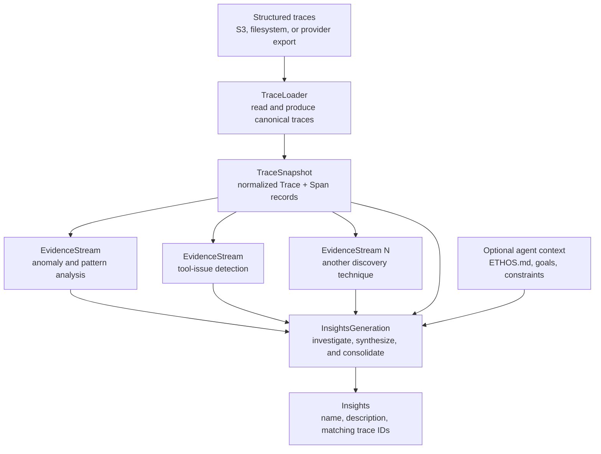
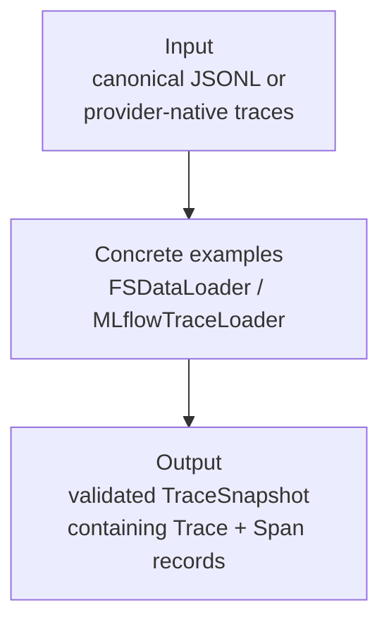
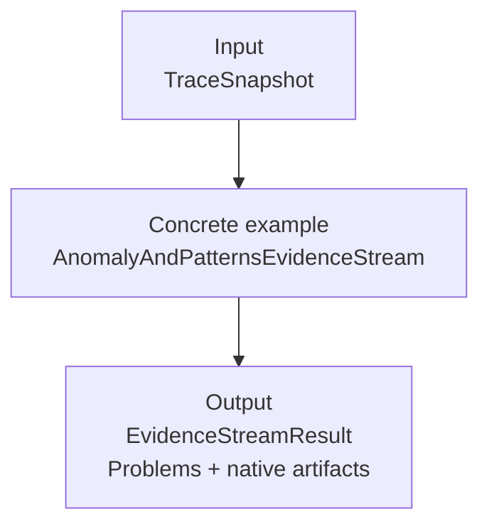
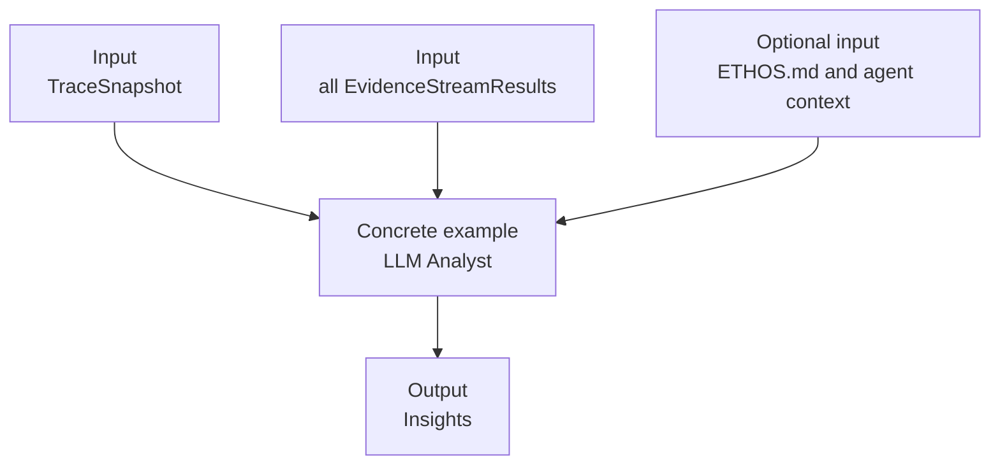

# Analyst architecture

The Analyst has one required product: **Insights**. Its top-level architecture is deliberately
small:

```text
TraceLoader -> TraceSnapshot -> EvidenceStream(s) -> InsightsGeneration -> Insights
```



`TraceLoader` is the input boundary, not a generic pipeline phase. `FSDataLoader` reads one
serialized `Trace` per JSONL line and validates it directly with Pydantic; it performs no
mapping. Provider-native loaders such as the MLflow loader own only the source-specific
conversion needed to produce the same public `Trace` values.

## 1. TraceLoader and TraceSnapshot



The loader contract is intentionally one method:

```python
class TraceLoader(Protocol):
    def load(self) -> TraceSnapshot: ...
```

Source-specific configuration and diagnostics stay on the concrete loader. Evidence streams
never receive provider records or loader objects.

A `TraceSnapshot` is the run-scoped view of the normalized corpus. It gives every
evidence stream and `InsightsGeneration` the same traces, span trees, source pointers, tool
definitions, and corpus identity.

### Normalized Trace

The normalized model is a purpose-built input to the current evidence streams and Analyst. It
does not mirror a trace-store API. A trace contains an ordered tree of spans plus aggregate
cost, latency, and token counts. Each span records one unit of
agent work, such as an LLM call, tool call, agent turn, chain, retriever, or evaluator.

Unlike NeMo Platform's storage/API models, this contract keeps `input` and `output` as JSON
values. An LLM span can therefore preserve complete input and output messages instead of
flattening them into text.

The contract is implemented as Pydantic v2 models. Its essential shape is:

```python
class SpanKind(StrEnum):
    LLM = "LLM"
    TOOL = "TOOL"
    AGENT = "AGENT"
    CHAIN = "CHAIN"
    RETRIEVER = "RETRIEVER"
    EMBEDDING = "EMBEDDING"
    RERANKER = "RERANKER"
    EVALUATOR = "EVALUATOR"
    GUARDRAIL = "GUARDRAIL"
    UNKNOWN = "UNKNOWN"


class ToolCall(BaseModel):
    call_id: str | None = None
    index: int | None = None
    result_id: str | None = None
    result_count: int = 1
    instrumentation_alias_of: str | None = None
    prior_user_text: str | None = None
    returned_data: bool | UNSET = UNSET


class Span(BaseModel):
    id: str
    kind: SpanKind
    children: list[Span]
    start_time: datetime | None = None
    end_time: datetime | None = None
    input: JsonValue | UNSET = UNSET
    output: JsonValue | UNSET = UNSET
    cost_usd: float | None = None
    token_counts: TokenCounts | None = None
    model: str | None = None
    tool_name: str | None = None
    tool_call: ToolCall | None = None
    error: str | None = None
    attributes: dict[str, JsonValue] = Field(default_factory=dict)


class Trace(BaseModel):
    id: str
    root_spans: list[Span]
    aggregate: TraceAggregate
    attributes: dict[str, JsonValue] = Field(default_factory=dict)
```

`UNSET` is Pydantic's missing sentinel and is distinct from JSON `null`. An absent tool-span
`output` means no result was observed, while `"output": null` means the tool returned `null`.
IA3 depends on that distinction.

Source loaders should populate span timestamps when the source records them. They are nullable
because a source may preserve authoritative order without wall-clock time; normalization does
not fabricate timestamps merely to satisfy the model.

`Trace.root_spans` and `Span.children` represent sequence and nesting directly:

- Root and child list order is authoritative.
- Evidence streams share one private root-first, depth-first traversal and do not independently
  flatten or sort spans.
- Span IDs must be unique across the complete tree.

The generic `attributes` mappings preserve optional source data without turning evidence-specific
annotations into core trace fields. Evidence streams interpret the attributes they own, including
source pointers, catalogs, case IDs, verdicts, and custom metrics.

A normalized record preserves LLM messages and tool activity directly in its nested span tree.
For example, an `AGENT` root can contain an `LLM` child whose own child is the resulting `TOOL`
span. Full structured message payloads remain in each span's `input` and `output`.

The contract deliberately contains only fields consumed by the current system:

- IA2 derives its ordered steps, tool calls, durations, cost, verdicts, and numeric features
  from spans, aggregates, and attributes.
- IA3 derives `CallRecord` values from `TOOL` spans and evidence-specific attributes.
- Insights Generation can fetch the same structured trace and inspect its message, tool, and
  result payloads.

Concrete example: `FSDataLoader` parses canonical JSONL directly. `MLflowTraceLoader` maps
MLflow API objects into these local models; it does not return or expose MLflow classes.

### Snapshot handoff

`TraceSnapshot` is a logical handle to one stable corpus. It is re-iterable and provides
lookup by trace ID.

Conceptually:

```python
class TraceSnapshot(Protocol):
    trace_count: int

    def __iter__(self) -> Iterator[Trace]: ...
    def get_trace_by_id(self, trace_id: str) -> Trace: ...
```

Each call to `iter(snapshot)` starts from the beginning and yields the same normalized traces in
the same order. It does not return a shared one-shot generator.

The first backing implementation is in memory. A JSONL or S3-backed implementation can be
added later if measurements show it is needed, without changing the evidence-stream interface.

Batch iteration can be added when scale measurements require it without changing the snapshot's
meaning.

## 2. EvidenceStream(s)



Evidence streams independently surface evidence that may support an Insight. Every stream:

- reads the same `TraceSnapshot`;
- can be enabled, disabled, and evaluated independently;
- does not read prior Insights or another stream's result;
- returns candidate `Problem` values with supporting trace IDs;
- may retain native artifacts for focused inspection and evaluation.

A stream may contain complex internal steps. IA2, for example, performs feature extraction,
anomaly detection, clustering, and recurring-pattern analysis. Those actions belong to IA2;
they do not become top-level Analyst stages.

```python
class EvidenceStream(Protocol):
    name: str

    def validate_configuration(self) -> None: ...

    def analyze(
        self,
        snapshot: TraceSnapshot,
    ) -> EvidenceStreamResult: ...


class Problem(BaseModel):
    description: str
    supporting_trace_ids: tuple[str, ...]


class EvidenceStreamResult(BaseModel):
    stream_name: str
    problems: tuple[Problem, ...]
    artifacts: Any = None
```

`Problem` is the common handoff to Insights generation. It says what may be wrong and which
normalized traces support investigating it. It does not claim root cause, impact, prevalence,
or that every matching trace has been found.

Native stream outputs remain available in `artifacts`, such as IA2's feature and clustering
results or IA3's findings and cards. They support diagnostics and evaluation but are not part
of the synthesis interface. Each stream owns the projection from its native analysis into
Problems, including its own evidence threshold.

The result does not carry generic coverage, status, version, or metrics fields. A stream that
cannot run raises an error; an empty `problems` tuple means it found nothing worth surfacing.
Stream-specific diagnostics remain in its typed artifacts. Input capability diagnostics, such
as IA3's per-rule coverage report, remain separate because they do not share a useful generic
shape across evidence streams.

Stable algorithm outputs are typed at the stream boundary as well. IA2 returns an
`AnomalyAndPatternsAnalysis` with typed anomalies and recurring-failure groups; IA3 returns
typed `ToolIssueCard` values with typed representative evidence. Temporary detector structures
can remain local dictionaries, but code outside the algorithm uses validated model attributes.

Each run explicitly registers its configured streams in an in-process
`EvidenceStreamRegistry`. Registration calls the stream's own
`validate_configuration()` method for runtime preflight checks such as provider credentials or
required dependencies. The registry rejects duplicate names and runs the selected streams
through the common interface; it does not discover imports or configure streams itself.

Each stream owns a typed configuration model that validates its algorithm settings. CLI or
service inputs are normalized into those models before stream construction; the registry never
receives untyped option mappings.

The Analyst collects the registered results and passes them directly to
`InsightsGeneration`. Collection is ordinary orchestration, not a separate merge or
composition phase.

## 3. InsightsGeneration



`InsightsGeneration` is a required, concrete Analyst capability—not a generic postprocessor.
It uses the evidence streams as a map, inspects supporting normalized traces from the snapshot, and
authors customer-readable Insights. It may consolidate overlapping evidence from multiple
streams, but evidence streams themselves remain independent.

The implementation is an explicit stage object:

```python
generation = InsightsGeneration(
    snapshot=snapshot,
    evidence=stream_results,
    agent=agent_name,
    corpus=corpus_description,
)
result = generation.generate()
insights = result.insights
```

Concrete example: the existing Analyst receives Problems from IA2 and IA3, fetches their
supporting canonical traces, and produces Insights through a versioned LLM prompt. It has no
dependency on either stream's native artifact type. The implementation and its prompt live
together under `insights_generation/`.

Historical reconciliation, lifecycle management, and comprehensive trace categorization can
be implemented inside this concrete capability as they are added. They do not require generic
postprocessor abstractions or additional top-level boxes.

## 4. Insights

Insights are the product contract, not an optional artifact. A successful run always emits an
Insights collection; an empty collection means the Analyst found nothing worth surfacing.

The current repository emits JSON objects with this shape:

```python
class Insight(TypedDict):
    name: str
    description: str
    trace_ids: list[str]
```

Stable identity, status, prevalence, and user decisions can extend this contract when insight
lifecycle management is implemented. The core requirement remains that every Insight is an
understandable claim grounded in exact traces.

## Running the Analyst

The built-in run configures one trace loader, loads one snapshot, runs the current evidence
streams, and invokes Insights generation:

```bash
uv run insight-agent run-all traces.jsonl -o out
```

Focused engine commands remain useful for development, regression testing, and ablation:

```bash
uv run insight-agent run-ia2 traces.jsonl -o out/ia2
uv run insight-agent run-ia3 traces.jsonl -o out/ia3
uv run insight-agent run-all traces.jsonl -o out/evidence-only --no-analyst
```

The architecture does not require YAML, import-time plugin discovery, or a general-purpose
workflow engine. A future `analyze` command may provide a clearer product entry point, but it
should construct this concrete Analyst directly rather than expose its stages as a pipeline
language.
